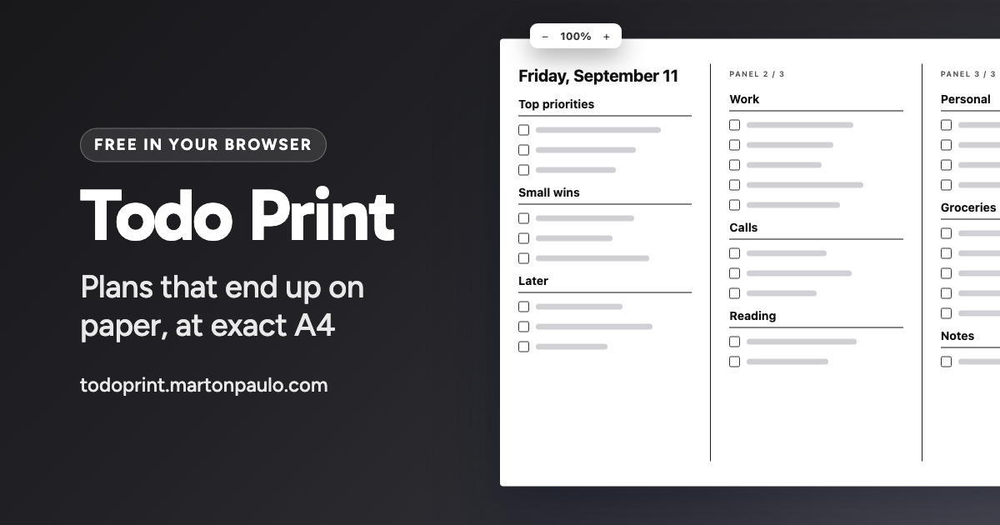

<div align="center">



# Todo Print

Design structured todo lists in a visual or Markdown editor and print them as exact-size A4 pages, three fixed panels per landscape sheet.

[](https://github.com/martonpaulo/todo-print/actions/workflows/deploy.yml) [](https://github.com/martonpaulo/todo-print/actions/workflows/pr-conventions.yml) [](https://react.dev/) [](https://vite.dev/) [](https://www.typescriptlang.org/)

</div>

**Todo Print** is for plans that end up on paper. Write a day's lists in a visual editor or in a
small Markdown subset, watch them flow into atomic `99mm x 210mm` panels as you type, and print
**three panels per A4 landscape page** at true physical size. Lists move between panels on their
own but are **never split**, and an overflow preflight blocks a printout that would come out
clipped.

It is a **browser-only tool**: no account, no backend, no analytics, and nothing uploaded. The
document lives in this browser's `localStorage`, exports and imports as plain Markdown, and becomes
a PDF through the browser's own print path. An optional typography setting redraws list content in
the **geometric alphabet William Moon published in 1845**.

<br />

---

## 🌱 Quick Start

```bash
npm install
npm run dev
```

Then open `http://localhost:5173` — Vite prints the exact URL in the terminal.

Requirements:

- **Node.js 24**, or another Vite 8-compatible release, and **npm 11+**
- A **Chromium-family browser** with `localStorage`, `ResizeObserver` and print CSS support.
  Chromium is the supported family; print output is verified against it only.

<br />

## 🛠 Commands

| Command | What it does |
| :--- | :--- |
| `npm run dev` | Vite dev server |
| `npm run build` | `tsc -b` then the production build into `dist/` |
| `npm run preview` | Serves `dist/` locally |
| `npm run lint` | oxlint |
| `npm test` | Vitest: Markdown conversion, persisted-data validation, atomic pagination |
| `npm run test:watch` | The same suite, watching |
| `npm run test:print` | The printed-page geometry check, in headless Chrome |
| `npm run check` | `lint`, `test`, `test:print`, `build`, in that order; the gate before a commit |
| `npm run profile` | Builds and drives a production build to report the editing-latency profile |
| `npm run social-card` | Renders `design/social-card/` into `public/social-card.jpg` |

<br />

## 🔐 Secrets and variables

**There are none.** The app reads no environment variable, has no `.env` file and holds no
credential — it has no backend to hold one for. The deploy workflow uses only the repository's
native `GITHUB_TOKEN`, which GitHub Actions provides automatically.

<br />

## Highlights

- Visual and Markdown editing on one route
- Exact `297mm × 210mm` A4 landscape pages
- Three fixed `99mm × 210mm` panels per page
- Lists automatically move between panels but never split
- Overflow preflight blocks clipped printouts
- Optional first-panel date and panel numbering
- Optional Moon type typography, drawing list content in the 1845 geometric alphabet
- Markdown export and import, and a PDF saved through the browser's own print path
- Browser-only persistence with no account, backend, analytics, or content upload
- Monochrome design tokens in `src/styles/tokens.css`

<br />

## Usage

### Visual editor

Edit list titles and tasks directly. Press Enter in a task to add the next one. Use **Add list** for another checklist and **Add panel** to force following content onto a fresh panel.

### Markdown editor

The supported subset is deliberately small:

```markdown
# 2026-08-24

## Morning
- [ ] Make coffee
- [x] Pack lunch

---

## Afternoon
- [ ] Call Alex
```

- `# YYYY-MM-DD` sets the optional document date.
- `## Title` starts a list.
- `- [ ]` and `- [x]` create todo items.
- `* [ ]` and `* [x]` are accepted on input and normalize to the canonical dash form.
- A plain `- Item` or `* Item` is accepted as an unchecked item.
- `---` forces a new panel.
- Unsupported lines are reported instead of silently discarded.

### Undo and redo

Structural edits, document settings, and Markdown commits share one document history for the
current tab.

- Press `Ctrl`/`Cmd` + `Z` to undo and `Ctrl`/`Cmd` + `Shift` + `Z` (or `Ctrl`/`Cmd` + `Y`) to redo.
  While the cursor is inside a text field the browser's own text undo keeps the shortcut, so typing
  is corrected where it happens.
- Removing a task, a list, or a panel break shows a status naming what was removed, next to an
  **Undo removal** button. The button is an ordinary focusable control, so keyboard, pointer, and
  touch users all recover the same way.
- Edits made less than 500 ms apart form one undo step, so typing is not undone character by
  character. A removal is always its own step, so undoing it never discards a nearby edit and never
  restores more than the status names. Any edit made after an undo discards the abandoned redo
  branch.
- History keeps at most the 100 most recent steps; recording beyond that drops the oldest one.
- History lives in memory for this tab only. It is never stored, so reloading the page starts a new
  history over the saved document.

### Moon type

**Moon type** in the toolbar redraws list titles and task text with the geometric alphabet William
Moon published in 1845, on screen and in the printed page. It is a visual alternative typography,
not an accessibility feature: the glyphs are vector outlines, not tactile relief.

- The setting belongs to the document and is saved with it in this browser.
- Moon type is caseless and defines a glyph for each of the 26 Latin letters. An accented letter is
  drawn as its base letter, so `programação` reads as one Moon word. Characters it does not cover —
  digits, punctuation, other scripts — keep their normal typeface, so dates and quantities stay
  legible.
- The editor's own input fields stay in the normal typeface, so the document remains editable.
- The underlying text is unchanged, so screen readers and copied text still read the Latin original.

The outlines are drawn from the published Grade 1 shape descriptions and are authored in
`src/domain/moon.ts` rather than loaded from a font, so the repository ships no third-party
typography asset.

### Printing and saving a PDF

Choose **Print A4**, then verify these values in the browser or system print dialog:

- Paper: A4
- Orientation: landscape
- Margins: none
- Scale: 100%
- Headers and footers: off

The application defines physical millimeter dimensions and `@page { size: A4 landscape; margin: 0; }`, but web applications cannot force printer-driver settings. A printer that cannot print edge-to-edge may still impose a hardware margin.

**Print or save as PDF** opens the same dialog; choose *Save as PDF* as the destination, with the
same settings. A web page cannot preselect that destination, so the dialog opens with whatever you
last used. Both actions are blocked while an oversized list or a Markdown error would produce a
clipped page.

### Markdown files

**Export Markdown** downloads the document as `todo-<date>.md`, holding exactly the source the
Markdown view shows — including a draft the parser rejects, which is the copy the storage guidance
tells you to take out of the app, and including a valid source written non-canonically, which is
never rewritten on the way out. **Import Markdown** reads such a file back and replaces the current document;
the replacement is one undo step. A file whose Markdown does not parse changes nothing: its source
opens in the Markdown view with the numbered errors that reject it.

The file is an export, not a second place the document lives. Browser storage stays canonical.

<br />

## Design tokens

All reusable visual and physical layout values live in `src/styles/tokens.css`. The print contract is grouped under **Physical print tokens**. Change those values carefully because they affect pagination measurements and paper output together.

<br />

## Validation

```bash
npm run lint
npm test
npm run test:print
npm run build
npm run check
```

Tests cover Markdown conversion, persisted-data validation, and atomic pagination. Pixel snapshots are intentionally omitted because they do not prove physical print dimensions.

`npm run test:print` is the printed-page geometry check. It serves the app, drives it in headless Chrome, and measures the rendered sheet and its panels in millimetres against the printed-page contract recorded in `AGENTS.md`, which it parses rather than repeats. It also generates a PDF through the browser's own print path and measures the declared page box. It needs a browser, so it is kept out of `npm test`; `npm run check` runs it. The first run downloads Chrome into Puppeteer's cache if `npm install` did not already provision it. `.puppeteerrc.cjs` pins that browser to one Chrome for Testing build and skips the chrome-headless-shell and Firefox downloads, so every machine and CI measure the same Chromium.

`npm run profile` drives a production build in a headless Chromium and reports the editing-latency profile. `docs/performance.md` records the supported document scale, the budget, and the measured results.

[CONTRIBUTING.md](CONTRIBUTING.md) has how to report a bug and the branch, commit and pull request conventions.

<br />

## Privacy and security

Todo content is stored only in this browser under `localStorage`. The app has no backend, account system, analytics, or content API. Clearing site data removes the saved document.

The editor states whether the document on screen is the one the browser holds. When a write is refused, the draft stays editable and is marked as not saved, so it can be copied out of the Markdown view before the tab closes. When stored content cannot be read, the editor shows a starter draft, saves nothing, and keeps the unreadable value until you choose to replace it.

<br />

## Deployment

Pull requests run lint, tests, and a production build. A validated push to `main` uploads `dist/` and deploys it through GitHub Pages using the repository's native `GITHUB_TOKEN`.

<br />

## Limitations

- Only the documented Markdown subset round-trips to the visual model.
- Content does not sync between browsers or devices.
- Undo history is per tab, is not stored, and keeps at most 100 steps.
- A single list cannot exceed one panel; shorten it before printing.
- Editing stays inside one frame up to 25 lists of 10 tasks; larger documents keep working but feel progressively slower. See `docs/performance.md`.
- Exact physical output depends on 100% print scale and printer-driver behavior.
- The public utility is indexable; the site is a single client-side route with no server-side access control.

<br />

## License

[MIT](LICENSE) © 2026 Marton Paulo.
